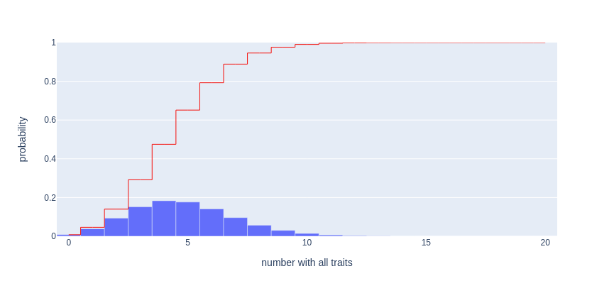

[](https://zenodo.org/badge/latestdoi/403796363)


This exact test assesses the statistical significance of finding a feature subset in binary feature data such that the number of simultaneously-positive samples is large, i.e. a "coincidence" of many features.

Everything needed to perform the test is located in the standalone module [_coincidencetest.py](https://github.com/nadeemlab/coincidencetest/blob/main/coincidencetest/_coincidencetest.py).

## Background
Let's say you're left-handed, blue-eyed, and you follow Neil deGrasse Tyson on Twitter. You go to a big concert with 10000 people, and you know your statistics so you expect about 1200 other left-handers, 1000 other people with blue eyes, and 400 other people who follow Neil deGrasse Tyson. And you were right! For some reason there was an entrance poll and there were 1200, 1000, and 400 people with these respective traits. And ... 20 people had *all 3 traits*. What are the chances!

But 20 doesn't seem like that much in this context. Maybe the chances are pretty good?

This kind of anecdote usually ends with someone pointing out that the probability of having all 3 traits, assuming they are not related, should be the product of the probabilities of each individual trait, so 0.12 * 0.10 * 0.04 = 0.00048. This is about 5 in 10000. And 20 sure is bigger than 5.

But this still doesn't tell us the chances of what you actually observed. All the calculation says is that 5 out of 10000 would be normal. How abnormal is 20 rather than 5? We still find ourselves asking: *What are the chances of 20 (or more) people out of 10000 having all 3 traits?*

The technique introduced in [our paper](https://arxiv.org/abs/2109.13876) and implemented in the Python package `coincidencetest` gives an exact answer to questions like this.



*The probability mass function (PMF) and cumulative distribution function (CDF) of the number of "coincidences" in the example described above.*

## Examples
Install from [PyPI](https://pypi.org/project/coincidencetest/):
```bash
pip install coincidencetest
```

Usage is shown below:
```py
import coincidencetest
from coincidencetest import coincidencetest
coincidencetest(20, [1200, 1000, 400], 10000)

1.153232141364226e-07
```
This example shows that the probability is about 10^-7 that 3 features, occurring with frequencies 1200, 1000, and 400 out of 10000, will simultaneously occur in 20 or more samples. This is exactly the same answer you would get if you were somehow able to do a brute-force permutation test, relabeling all feature assignments in *all possible (10000! * 10000! * 10000!) ways*, and counting the number of times simultaneous co-occurence took place in 20 or more samples.

The example `coincidencetest(1, [5, 3, 7], 100)` yields p=0.01047, showing that the probability of *even just one* sample having all features can be very low, provided that enough of the features are individually relatively rare.

In the case of just 2 features, the test reduces to the [Fisher exact test](https://en.wikipedia.org/wiki/Fisher%27s_exact_test), as demonstrated below:
```py
import coincidencetest
from coincidencetest import coincidencetest

import scipy
from scipy.stats import fisher_exact

def do_fisher(i, frequencies, n):
    assert len(frequencies) == 2
    a = i
    b = frequencies[0] - a
    c = frequencies[1] - a
    d = n - a - b - c
    return fisher_exact( [[a, b], [c, d]], alternative='greater')[1]

coincidencetest(2, [5, 6], 100)
do_fisher(2, [5, 6], 100)

coincidencetest(8, [20, 35], 1000)
do_fisher(8, [20, 35], 1000)

...
0.02788637479359129
0.027886374793591354

9.154856826040717e-08
9.154856826030284e-08
```

## CLI application
To make the test immediately useful, this package is distributed together with a lightweight "Formal Concept Analysis" feature set discovery tool.

The installed package exposes the command-line program `coincidence-clustering` incoporating this tool. Use it like so:
```bash
coincidence-clustering \
  --input-filename=example_data/bc_cell_data.tsv \
  --output-tsv=signatures.tsv \
  --level-limit=50 \
  --max-recursion=3
```

## Web application
A Javascript port of the signature discovery and testing program is located in `webapp/`. To run it locally, use:
```bash
cd webapp/
chmod +x build.py
./build.py
python -m http.server 8080
```

Then open your browser to `localhost:8080` or `0.0.0.0:8080`.

*Note*: The Javascript application only requires the server to have the capability of serving static files, namely the files `index.html` and `worker.js` created by the build process. However, most browsers block the use of the "web workers" from the local file system, so this minimal Python server is needed for local deployment. We use web workers in order to allow dynamic display of feature sets in real-time as they are identified.

## Code testing
The package is tested with
```bash
pytest .
```

The key step is a computation of the number of covers of a set of a given size by sets of prescribed sizes (equivalently, the number of subsets of prescribed sizes without common intersection), so the most important tests check that several different algorithms for cover counting agree in small-number cases.

## Issues
Please report all issues as [GitHub issues](https://github.com/nadeemlab/coincidencetest/issues).

## License
© [Nadeem Lab](https://nadeemlab.org/) - The [core module](https://github.com/nadeemlab/coincidencetest/blob/main/coincidencetest/_coincidencetest.py) is distributed under the [3-clause BSD license](https://opensource.org/licenses/BSD-3-Clause). All other modules are distributed under [Apache 2.0 with Commons Clause](https://commonsclause.com) license, and are available for non-commercial academic purposes.

## Reference
If you use this code or parts of it, please cite [our paper about the technique](https://arxiv.org/abs/2109.13876):
```
@article{mathews2021coincidencetest,
  title={An exact test for significance of clusters in binary data},
  author={Mathews, James C, and Crowe, Cameron and Vanguri, Rami and Callahan, Margaret and Hollmann, Travis J and Nadeem, Saad},
  journal={arXiv},
  year={2021}
}
```
