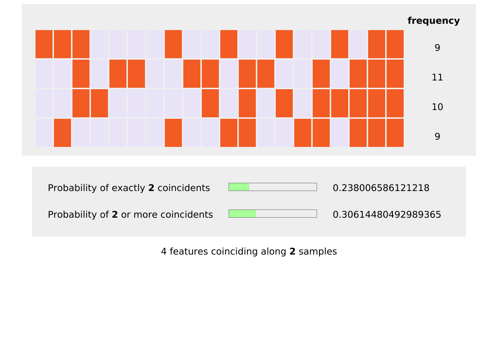

Steps to generate an SVG image of the interactive demo display:

1. `./generate_interactive_demo.py`
2. Then view `interactive_demo.html` in a browser.
3. Use the "Download HTML" link to export `figure.html`.
4. Get `figure.html` into this directory.
5. `./convert_html_svg_snippet.sh`
6. `figure.svg` is created.

